```{r setup, include=FALSE}
knitr::opts_chunk$set(echo = TRUE)
```

<br>

## Introduction


This Shiny app allows to perform Gene Ontology (GO) enrichment analysis using clusterProfiler, an R package for comparing biological themes among gene clusters 
( <http://bioconductor.org/packages/release/bioc/html/clusterProfiler.html> ).

The entry point for the app is a result table from a Differential Expression (DE) analysis of a RNA-Seq experiment (e.g. from DESeq2 or EdgeR). The table should have at least 5 columns:

* **GENE ID**: these can be either **Gene Symbols** or **Ensembl ID** - **Gencode IDs** are also supported;
* **MEAN EXPRESSION** (**NOT** log transformed, as in standard output for DESeq2);
* **LOG2 FOLD CHANGE**;
* **P-VALUE**;
* **ADJUSTED P-VALUE**;

Also, the app expects a **NOT FILTERED** result table (this means that the table should report all genes that entered the DE analysis pipeline, including genes for which the adjusted pvalue = NA).


You can also use this app if you have several cluster of genes and you want to compare which GO term is associated with each cluster. In this case, the entry point is a table with at least 2 columns:

* **GENE ID**: these can be either **Gene Symbols** or **Ensembl ID** - **Gencode IDs** are also supported;
* **CLUSTER**: the cluster to which each gene belongs.

<br><br>


## 1. Load Data

To load your table, go to the **Upload Panel**, and click the **Browse** bottom. You can select the DE analysis result table that you want to import. When the upload is completed, the imported table will be displayed on the **Input Table** panel. 

Next, you can select which column is the **Gene Names/IDs**. You can specify whether the IDs are **Symbol** or **Ensembl** by cliking on the corresponding button. In the same way, you proceed by selecting which columns store the **Mean Expression**, **Log2 Fold Change**, **pvalue** and **adjusted pvalue**. 

Once this operation has been completed, you are ready to visualize the results of your DE analysis by clicking on the **MAplot - Volcano Plot** panel.
 
<br>

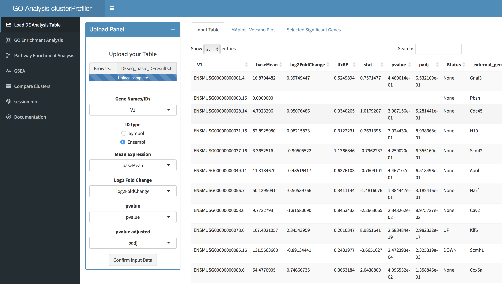

<br><br>
 
## 2. Visualize DE Analysis

The panel **MAplot - Volcano Plot** shows - guess what? - an MA-plot and a Volcano Plot for your data. 

You can play around with the two sliding bars on the right box to define a custom **adjusted pvalue threshold** for significance (from 0.001 to 0.1) and a custom **fold change threshold** for significance (from 1 to 5; NOTE: this is **NOT** in log scale, so if you want to select genes whose expression is twice as high compared to your reference samples, you just select **2**).

Every time you will change these values, the plots will be updated. Below the sliding bars, a **summary** will tell you the total number of significantly differential genes, and the number of significantly up- and down-regulated genes.

If you want to see which genes have passed your significance threshold, you can move to the **Selected Significant Genes** panel.

It is at this stage that you are defining the genes that will be tested in the following GO enrichment analysis. 
 
<br>

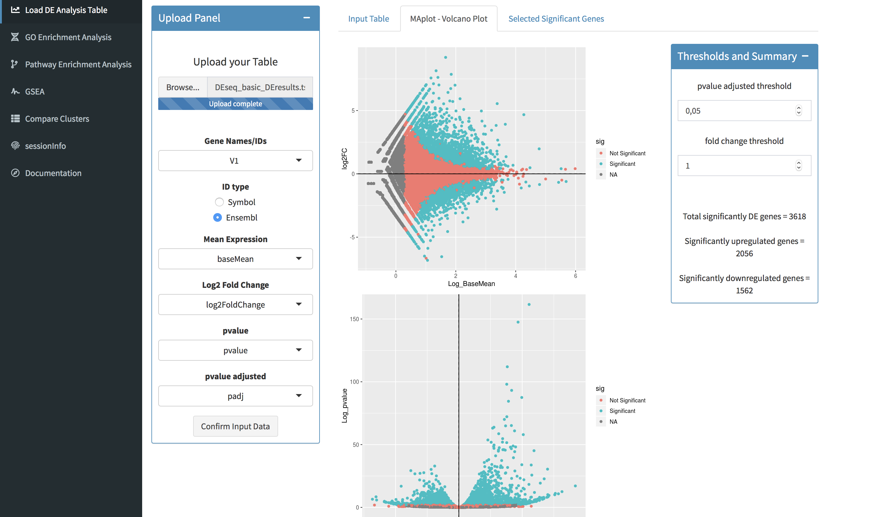

<br><br> 
 
## 3. GO Enrichment Analysis

Once you are happy with your significance thresholds, you can click on the **Standard Enrichment Analysis** panel that you find on the left sidebar. 

In the landing page, you will find a venn diagram summarizing the number of genes that will enter the GO enrichment analysis. On the right side of the page, a **Control Panel** will allow you to define the parameters of your analysis. 

In the **Control Panel**, select the model organism that you are working with (3 species are currently supported: **Mus musculus**, **Homo sapiens** and **Drosophila melanogaster**). Next, you can refine your **target set**: in the **Target Set** drop-down window, you choose if you want to run the test on the total DE genes, or on the subsets of significantly up- or down-regulated genes separately. Eventually, you can chose whether you want to use only expressed gene or all genes as **background** for your analysis (NOTE: **Expressed Genes** will discard genes with a padj = NA, while **All Genes** will select all genes in your imported table). 
 
<br>

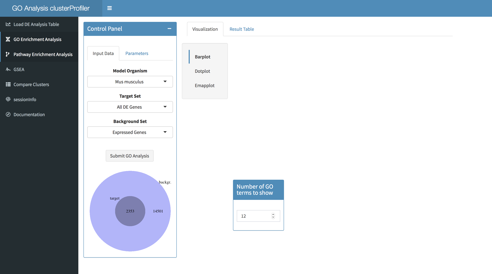

<br> 
   
You can further refine the analysis paramenters by clicking on the **Parameters** sub-panel. In here, you can choose the **Type of Analysis** (only **GO over-representation test** is currently available), the **Subontology** (**Molecular Functions**, **Biological Processes**, **Cellular Compartments** or **All**), the **pvalue threshold**, the **qvalue threshold** and the **pvalue adjust method**.
 
<br>
<center>
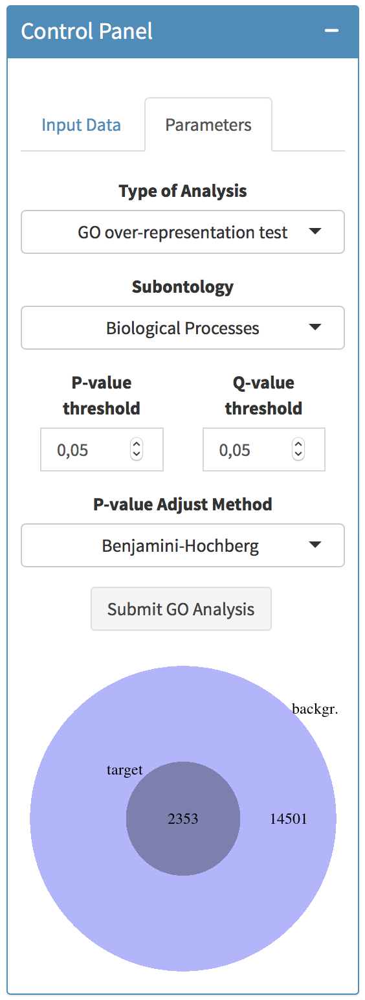{height=400px, width=200px}
</center>

<br>

Once all parameters are set, click on **Submit GO Analysis** button to start the analysis.

<br><br>
 
## 4. Visualize and Download results
 
The analysis takes few minutes to run. Once completed, you can visualize the result of your GO enrichment analysis by clicking on the **Visualization** panel. 
 
You can choose between three types of visualization: **Barplot**, **Dotplot** and **Emapplot**. You can tweek the number of significant GO terms to show in each plot using the small panel on the right. If you want to **download** the graphs, right-click on the images and save it on your computer.

<br>

### Barplot

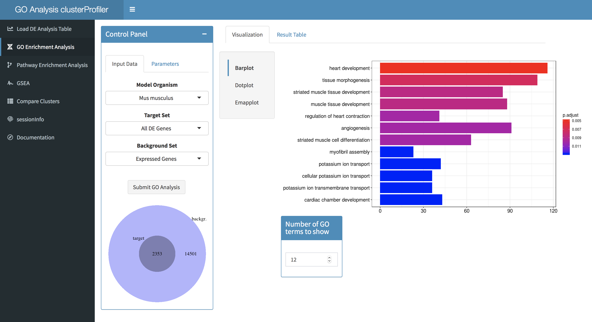
 
<br> 

### Dotplot
 
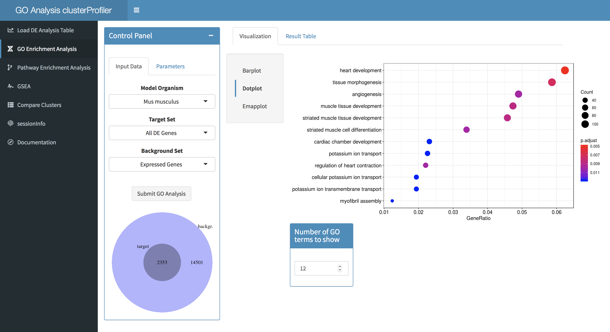

<br>
  
### Emapplot

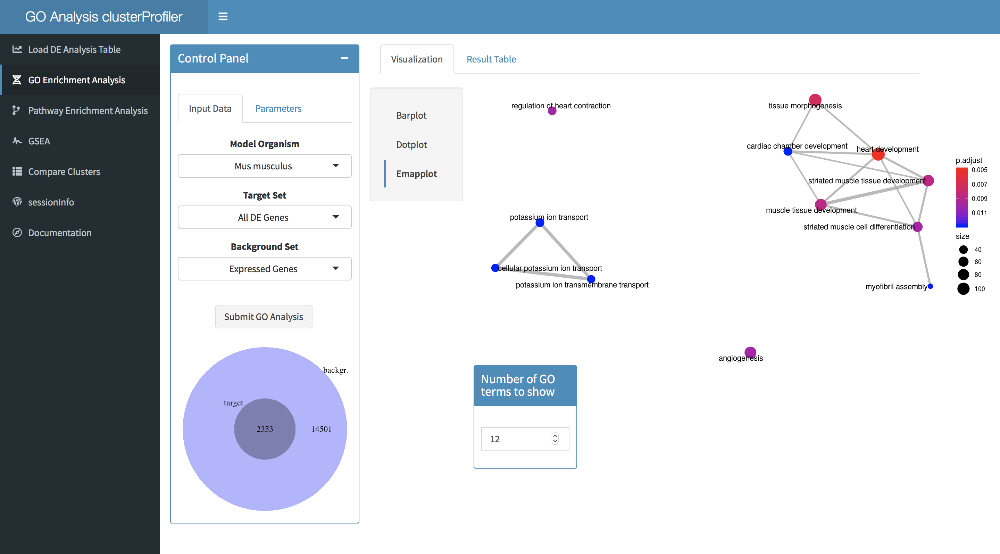

<br> 

By clicking on the **Result Table** panel, you can visualize the result of your analysis in a table format. This is the way to go if you want to understand which genes are associated with each significant GO term. You can **download** the table by clicking on the **Download** button above the result table.

<br>
 
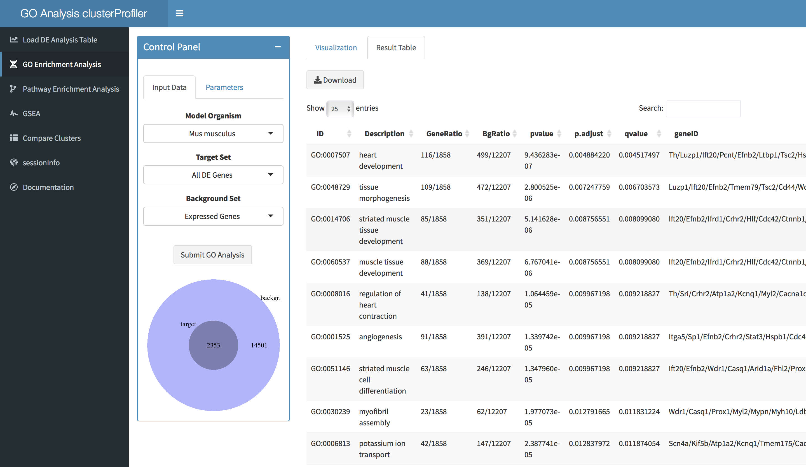

 
<br><br>
 
## 5. Compare Clusters

If you want to compare clusters of genes and identify enriched GO terms specific for each, click to the **Compare Clusters** panel on the left sidebar. 

If you want to expand on the GO term analysis from the DE analysis, select from the **Input Panel**, import **From DE analysis (Up vs Down)**. After selecting the **Subontology** of preference, click on **Submit Compare Cluster Analysis** button. The analysis will yield enriched GO terms for the comparison up-regulated VS down-regulated genes. By clicking on the **Result Table** panel, you can visualize and download a detailed result table. 

<br>

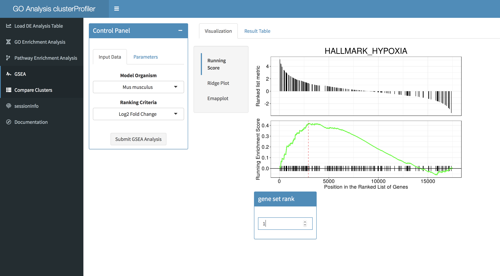
<br><br>   

If you want to characterize previously clustered groups of genes, choose to **Import Clusters From Table** from the top **Input Panel**.
You can import a table in tsv (tab separated values) format, with at leat 2 columns:
  
  * **Gene Names / IDs**
  * **Clusters**

Once the upload is completed, use the drop-down menus **Gene Names/IDs** and **Clusters** to select which columns of your input table hold the respective information. Select whether gene identifiers are **Symbol** or **Ensembl** IDs (Gencode IDs are supported) using the **ID type** buttons. You can visualize the selected data on the **Input Table** panel on the main page.
Click on **Confirm Cluster Column** to confirm your choices. Then, you can select which clusters to include in the analysis by (de)selecting them. Next, select the **Model Organism** and the **Subontolgy**. Click on the **Submit Compare Clusters Analysis** to start your analysis.

<br>

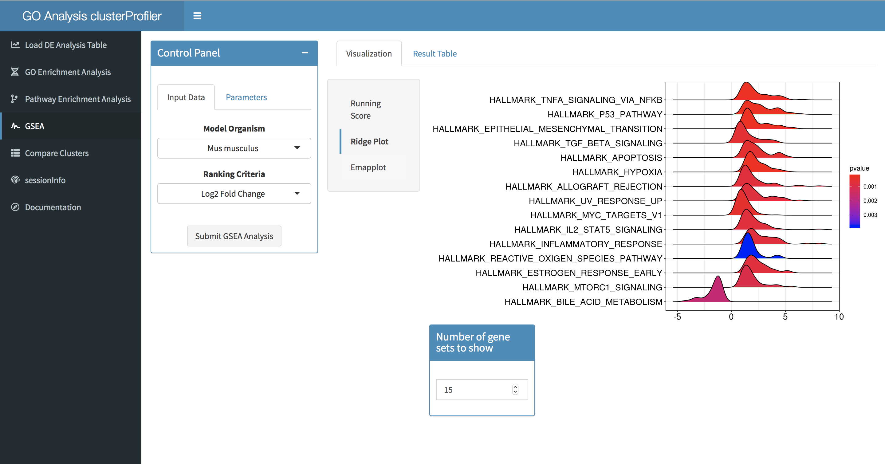
<br><br>  
 
Result of your analysis will be displayed as a dotplot in the **Visualize Results** panel. You can choose the number of terms to shows in the graph using corresponding box. As before, you can visualize and download a **Result Table** by clicking on the homonomous panel.   

<br>
 
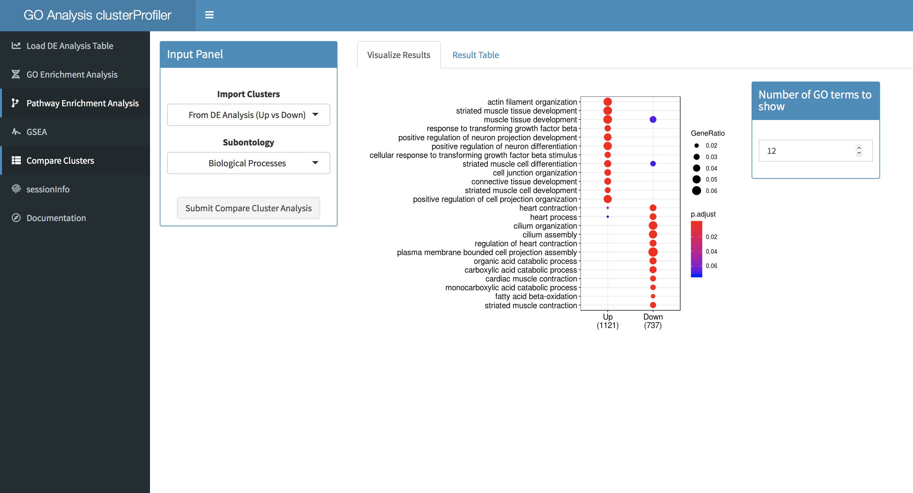  
<br><br>


## SessionInfo

The **sessionInfo** panel summarises the details of the R environment used for the analysis. This is usefull if you want to reproduce your results years from now, as it specifies the version of the packages used.   
 
<br> 

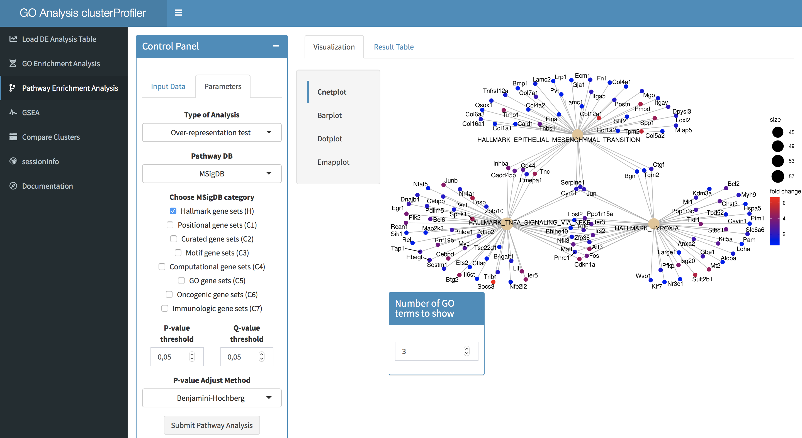

<br>

***

<br>

If you use this app in your research, make sure to cite clusterProfiler:

Yu G, Wang L, Han Y, He Q (2012). “clusterProfiler: an R package for comparing biological themes among gene clusters.” OMICS: A Journal of Integrative Biology, 16(5), 284-287. doi: 10.1089/omi.2011.0118.

<br><br><br><br>